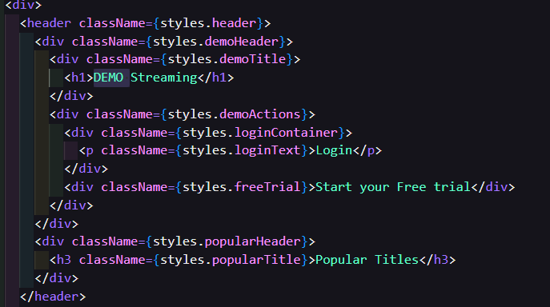
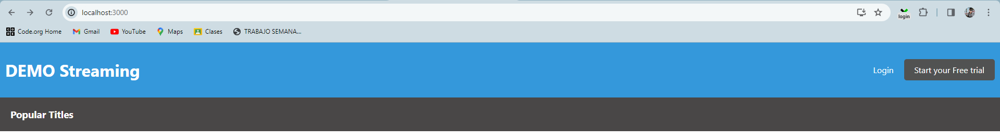
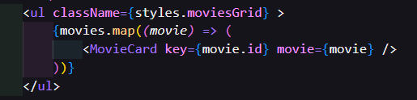
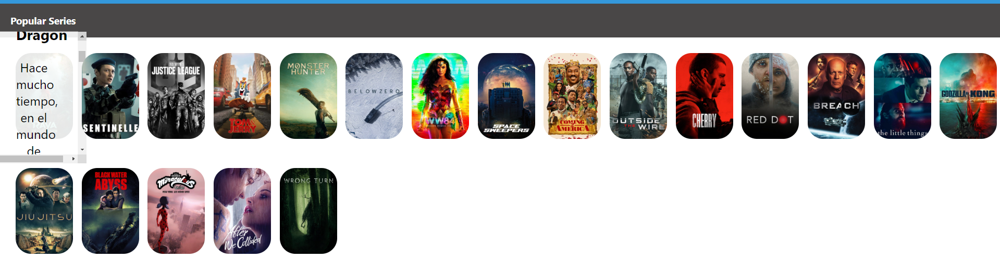
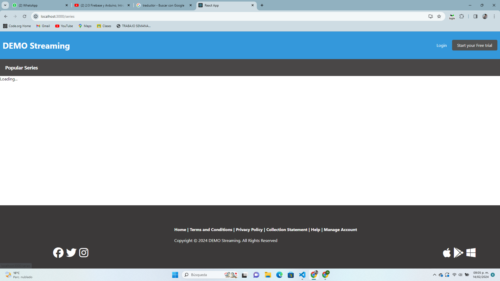
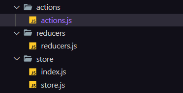

## PASOS E INSTRUCCIONES DE PRUEBA ## 

1.. Comenzé con el proyecto creandolo con npx create-react-app pelis-lazaro 
npm run start para inicializar  la aplicación en modo desarrollo.

2.. usé estilos CSS que está en la documentación de create react app que se llama Adding Styleshet, 
esto para hacer prueas de estilos en mi index.js con un fondo negro y un itulo, que al final me decidi por un blanco como la 
imagen proporcionada 

3.. creé el archivo inicio.js que renderizaba en el index 
4.. hice 2 header que se ven en la parte superior de la web en el archivo de inicio.js 

5.. en la parte del Json tuve que usar otro ya que no se si solo era cosa mia ue no me funcionaba el proporcionado 
 lo que hice aqui fue usar el metodo map() para iterar sobre el arreglo de peliculas llamado movies, 
por cada pelicula en el arreglo se crea un elemento <MovieCard> con el key de la pelicula est hace que se cree una lista de componentes

6.. en el archivo de MovieCard.js 
utilize <li className={styles.movieCard}> que me renderiza un elemento <li> con la clase CSS movieCard, La clase movieCard del archivo css pa darle estilos

 tamien utilizé img className={styles.movieImage} que me  renderiza una imagen de la película. La URL de la imagen se construye utilizando la URL base de TMDB

el 
: hizo que renderizara un 
 con la clase CSS, la capa se pondrá sobre la imagen de la película y contuvo  el título y la descripción de la película.

<h3>{movie.title}</h3>: me renderizó el título de la película. El título se toma del objeto movie.

{movie.overview}
: renderiz+o la descripción de la película

6 .. agregué un footer que o tiene mucha importancia pero se ve 

7.. hice const [loading, setLoading] = useState(true); esto declara un estado llamado loading utilizando el hook useState. Inicialmente se establece en true, lo que indica que la página está cargando  

8.. en seriesPage.js y en Moviespage agregué consts [ showFooter, setShowFooter] = useState(false) utilizando el hook 
useState para q que el pie de página no se muestre.
useEffect(() => {}, []) va a definir  un efecto secundario que se ejecuta solo una vez después de que el componente se monta dentro de este efecto, se utiliza setTimeout para simular una carga de 1 segundo estableciendo loading en false después de un retraso de 1 segundo.

9-- para agregar redux  a mi proyecto, primero instalé npm install redux react-redux
creé las carpetas de actions, reducers, y store  para manejar esl estado relacionado con las peliculas 
 Utilizé un switch statement para manejar diferentes tipos de acciones, dependiendo del tipo de acción, el reducer actualizará el estado de manera adecuada.

case ADD_MOVIE, en el caso de la acción ADD_MOVIE, el reducer crea un nuevo estado con una nueva película agregada a la lista de películas.

Se deberá incluir además un documento que responda a las siguientes preguntas.

¿Cómo decidió las opciones técnicas y arquitectónicas utilizadas como parte de su solución?
R= me basé en los requisitos que pedia el proyecto, ademas de investigar cada tipo de librerias o paquetes  que podría usar para mejorar la experiencia 

¿Hay alguna mejora que pueda hacer en su envío?
R= las cosas que me faltaron como lo de mostrar los resutados o agregar un estado de error 

¿Qué haría de manera diferente si se le asignara más tiempo?
cambiaria muchisimo, ya que agregaria loq ue me faltó, ademas de un buscador que encuentre por el nombre que le pongamos una pelicula,
o utilizar mas hooks y mejorar el diseño ademas de agregar otro json  para mostrar información adicional de cada película.

